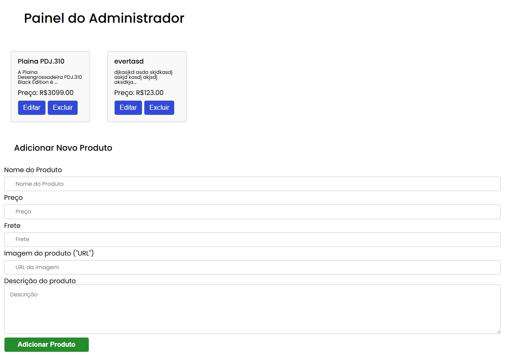
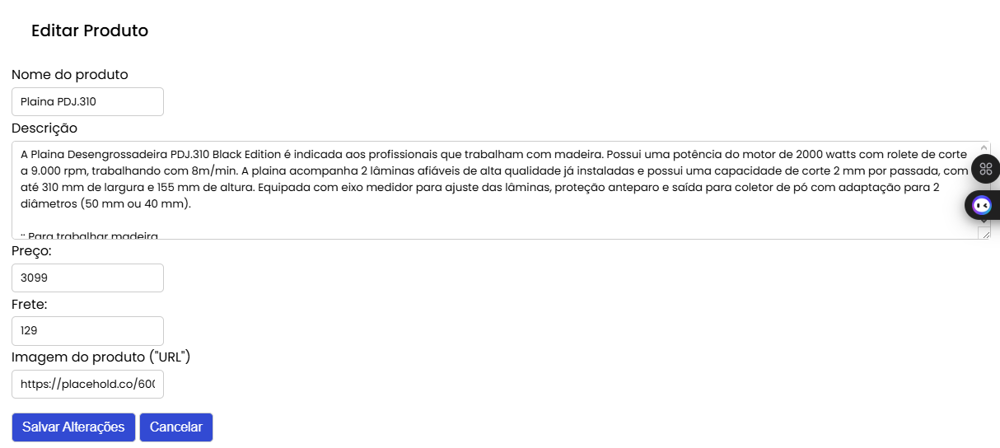
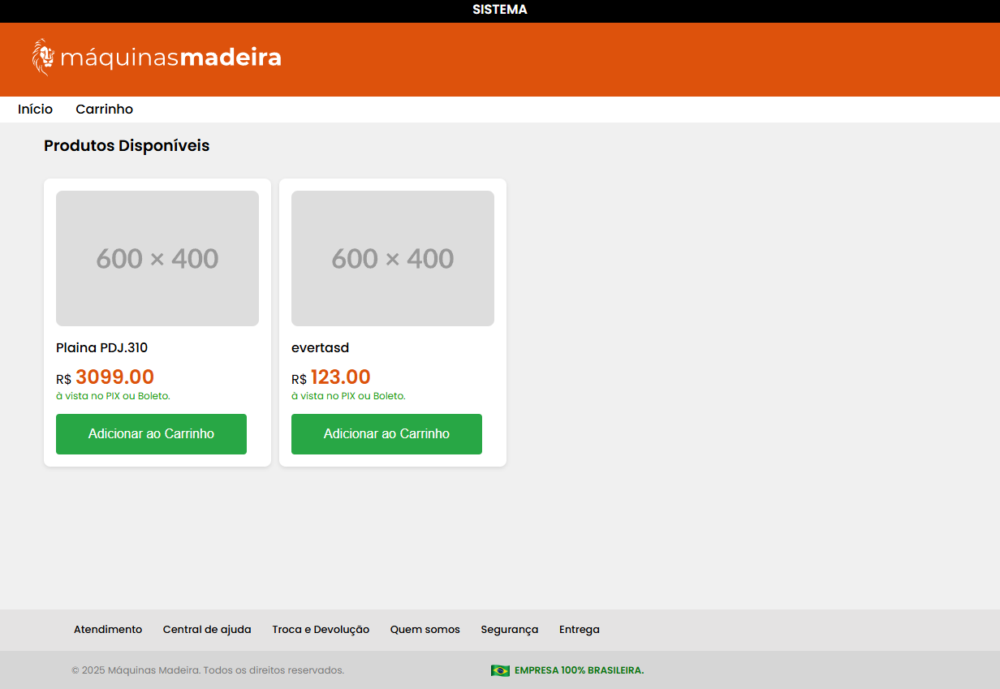
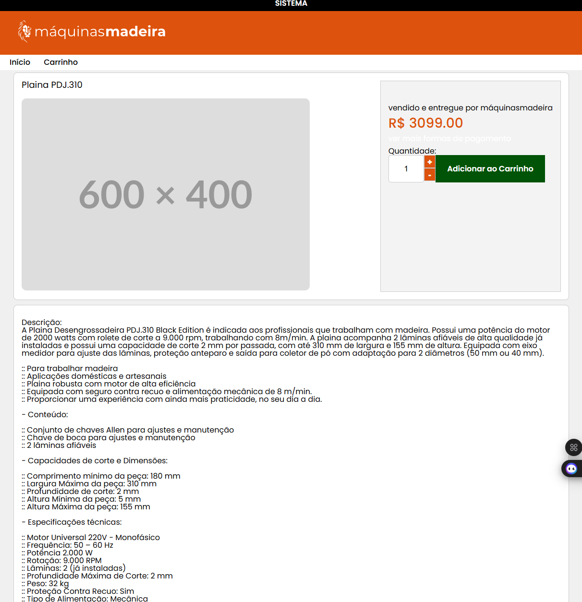
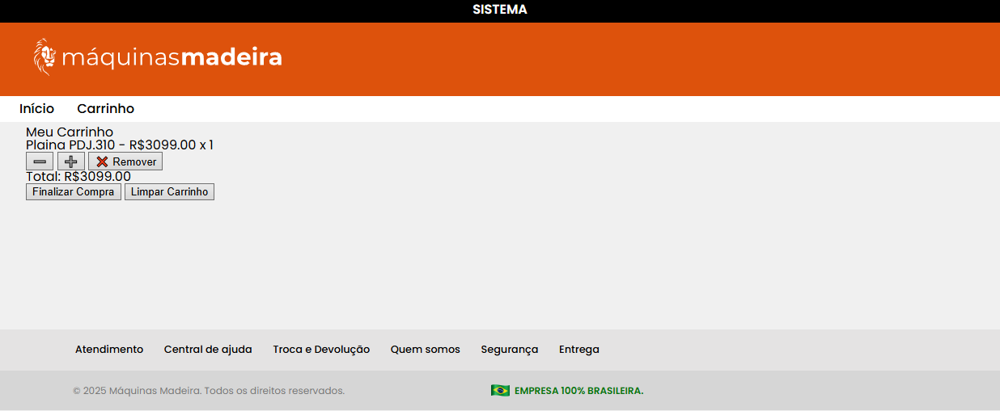

# 🛠️ E-commerce Máquinas Madeira

Projeto de e-commerce especializado em máquinas e equipamentos de marcenaria. Desenvolvido com foco em performance, organização modular e escalabilidade — tanto para administradores quanto para usuários finais.

---

## Estrutura do Projeto

### Frontend _(desde a versão 1.0.0)_

- Páginas implementadas:
  - `index.html`: página inicial com lista de produtos
  - `product.html`: exibe detalhes do produto com destaque e entrega expressa
  - `cart.html`: carrinho de compras com controle por `localStorage`
  - `checkout.html`: estrutura pronta, aguardando integração de pagamento
- Estilos organizados em `/styles`:
  - `style-system.css`, `header.css`, `footer.css`, `product.css`, `cart.css`
- Recursos visuais em `/assets`: imagens, ícones, screenshots

### Backend _(desde a versão 1.0.0)_

- API RESTful com Node.js + Express
- MongoDB como banco de dados (`ecommerce_db`)
- Arquitetura modular:
  - Modelos em `/models` (`Produto.js`)
  - Lógica principal no `server.js`
- Funcionalidades administrativas:
  - CRUD completo de produtos
  - Botões para alternar `highlight` (destaque) e `express` (entrega rápida)
  - Selo visual exibido diretamente no painel e frontend

---

## Integração de Pagamentos _(previsto para versão 1.3.x)_

- Página de checkout estruturada
- Planejada integração com API da **Pagar.me**
- Funcionalidades futuras:
  - Processamento de pagamentos
  - Cancelamento, estorno e atualização de status

---

## Funcionalidades Atuais _(versão 1.1.3)_

- Carrinho persistente com `localStorage`
- Navegação dinâmica entre páginas e produtos
- Exibição de selos visuais `⭐ Destaque` e `🚚 Entrega Expressa`
- Botões no painel admin com ação toggle para marcações especiais
- Página individual de produto com carregamento por ID via URL

---

## Rotas da API

| Método | Rota                  | Descrição                           |
|--------|------------------------|-------------------------------------|
| GET    | `/produtos`            | Lista todos os produtos             |
| GET    | `/produto/:id`         | Retorna dados de um produto por ID  |
| POST   | `/produtos`            | Cria novo produto                   |
| PATCH  | `/produtos/:id`        | Atualização parcial (express/destaque) |
| PUT    | `/produtos/:id`        | Edição completa de produto          |
| DELETE | `/produtos/:id`        | Remove produto do banco             |

---

## Interface Overview

*Painel admin com cards de produto e ações visuais*

*Interface de edição rápida direto do dashboard*

*Visual responsivo com selos e botão de compra*

*Página de produto com selo e botão de carrinho*

*Carrinho com controle de quantidade e valor total*

---

## Roadmap & Próximas Etapas

 Planejadas para versões `1.3.x`:

- Finalizar integração de pagamentos (Pagar.me)
- Adicionar sistema de login para administradores
- Criar login para usuários finais
- Implementar painel de produtos em promoção
- Adicionar lógica de preço promocional:
  - Valor original com traço
  - Valor com desconto + porcentagem de economia
- Avaliação por usuários autenticados
- Testes automatizados e deploy em ambiente cloud

---

Projeto em constante evolução — cada versão é construída com base em melhorias reais e correções documentadas no [`CHANGELOG.md`](./CHANGELOG.md)