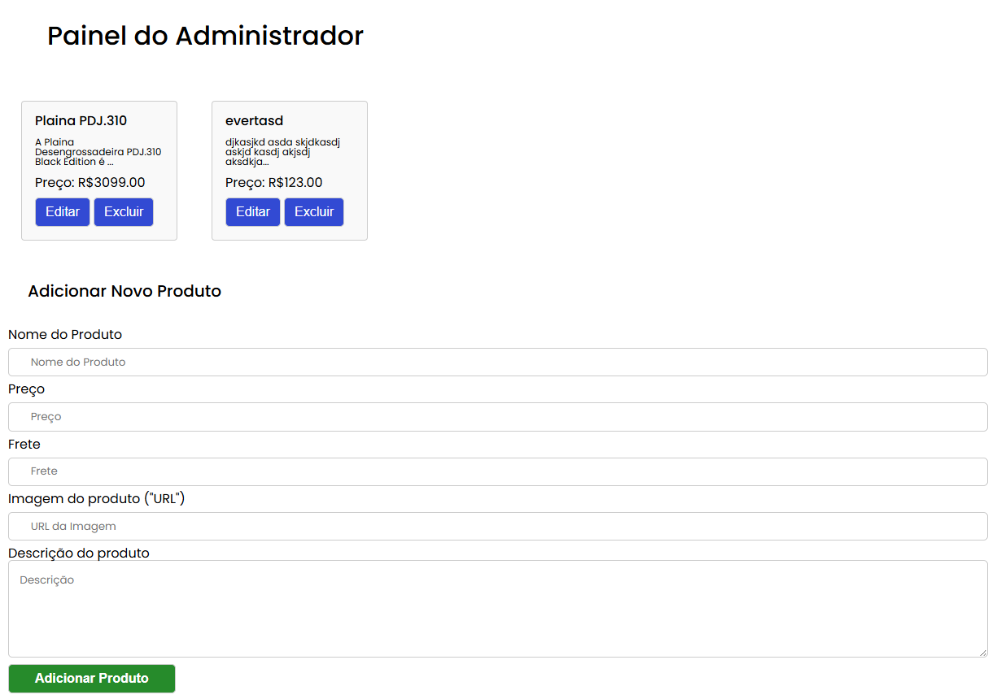
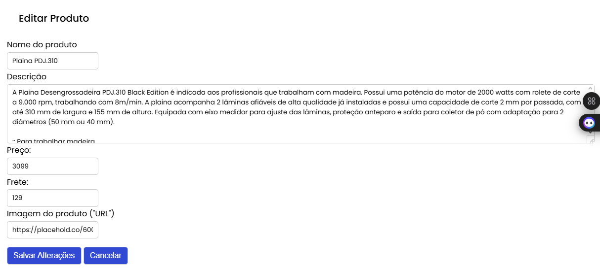
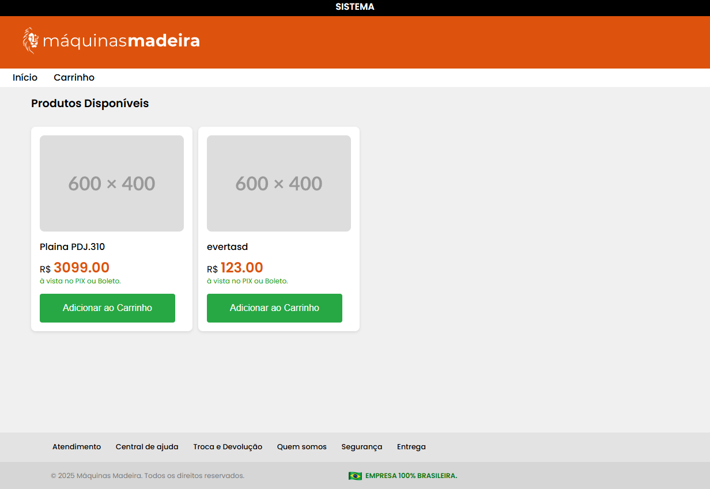
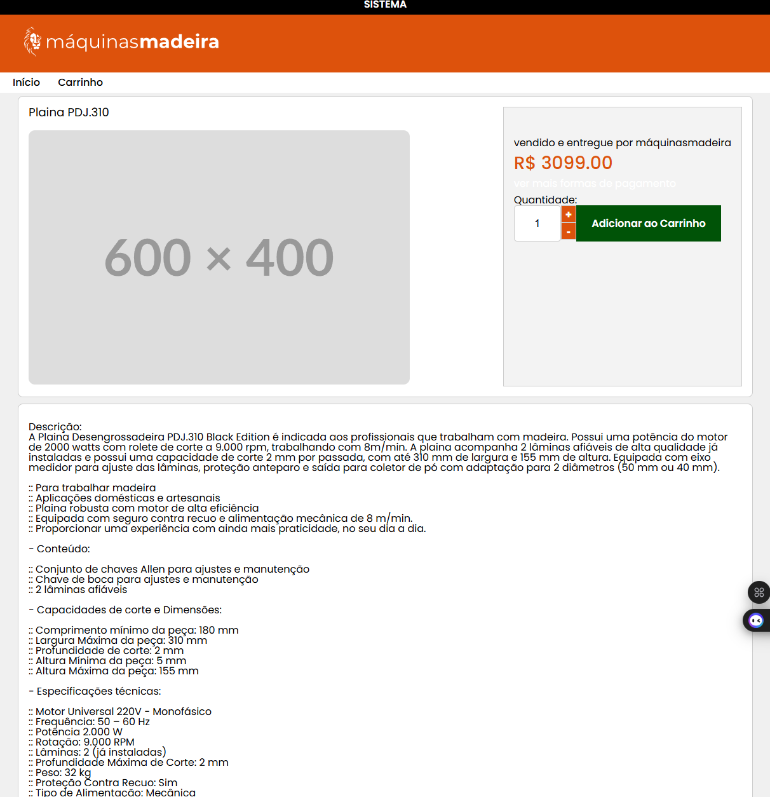
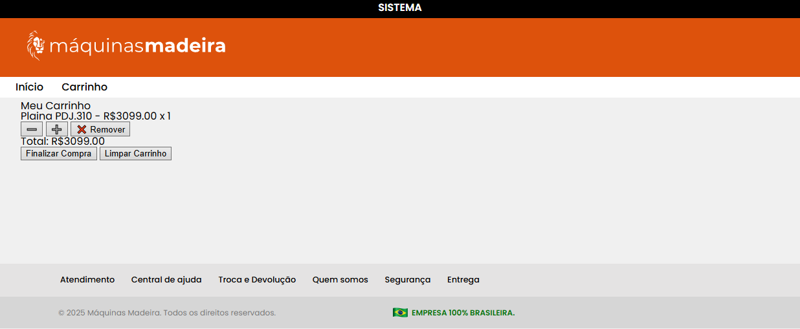

# 🛠️ E-commerce Máquinas Madeira

Projeto de e-commerce especializado em máquinas e equipamentos de marcenaria. Desenvolvido com foco em performance, organização modular e escalabilidade — tanto para administradores quanto para usuários finais.

---

## Estrutura do Projeto

### Frontend _(desde a versão 1.0.0)_

- Páginas implementadas:
  - `index.html`: página inicial com lista de produtos
  - `product.html`: exibe detalhes do produto com destaque e entrega expressa
  - `cart.html`: carrinho de compras com controle por `localStorage`
  - `checkout.html`: estrutura pronta, aguardando integração de pagamento
  - `register.html` e `login.html`: sistema de autenticação
  - `dashboard.html`: área protegida com dados do usuário autenticado
- Estilos organizados em `/styles`:
  - `style-system.css`, `header.css`, `footer.css`, `product.css`, `cart.css`
- Recursos visuais em `/assets`: imagens, ícones, screenshots

### Backend _(desde a versão 1.0.0)_

- API RESTful com Node.js + Express
- MongoDB como banco de dados (`ecommerce_db`)
- Arquitetura modular:
  - Modelos em `/models` (`Produto.js`)
  - Lógica principal no `server.js`
  - Controladores em `/controllers`
  - Rotas em `/routes`
  - Middleware de autenticação ( verifyToken.js )
- Funcionalidades administrativas:
  - CRUD completo de produtos
  - Botões para alternar `highlight` (destaque) e `express` (entrega rápida)
  - Sistema de autenticação com JWT
  - Proteção de rotas privadas
  - Retorno personalizado com nome, email e role do usuário

---

## Funcionalidades Atuais _(versão 1.4.0)_

- Carrinho persistente com `localStorage`
- Navegação dinâmica entre páginas e produtos
- Exibição de selos visuais `Destaque` e `Entrega Expressa`
- Botões no painel admin com ação toggle para marcações especiais
- Página individual de produto com carregamento por ID via URL
- Sistema de login e registro com proteção de sessão
- Dashboard com:
- - Dados do usuário autenticado
  - Lista de pedidos
  - Lista de Desejos
  - Formulário para atualizar nome e email

---

## Rotas da API

| Método | Rota                  | Descrição                           |
|--------|------------------------|-------------------------------------|
| GET    | `/produtos`            | Lista todos os produtos             |
| GET    | `/produto/:id`         | Retorna dados de um produto por ID  |
| POST   | `/produtos`            | Cria novo produto                   |
| PATCH  | `/produtos/:id`        | Atualização parcial (express/destaque) |
| PUT    | `/produtos/:id`        | Edição completa de produto          |
| DELETE | `/produtos/:id`        | Remove produto do banco             |
| POST   | `/register`            | Cria novo usuário                   |
| POST   | `/login`               | Autentica usuário e retorna token   |
| GET    | `dashboard`            | Retorna dados do usuário autenticado |

---

## Interface Overview

*Painel admin com cards de produto e ações visuais*

*Interface de edição rápida direto do dashboard*

*Visual responsivo com selos e botão de compra*

*Página de produto com selo e botão de carrinho*

*Carrinho com controle de quantidade e valor total*

---

## Roadmap & Próximas Etapas

 Planejamento para futuras versões:

- Finalizar integração de pagamentos (Pagar.me)
- Adicionar sistema de login para administradores
- Implementar painel de produtos em promoção
- Adicionar lógica de preço promocional:
  - Valor original com traço
  - Valor com desconto + porcentagem de economia
- Avaliação por usuários autenticados
- Testes automatizados e deploy em ambiente cloud
- Sistema de fretamento dos produtos
- Variações de produtos como:
  - Cor
  - Tensão
  - Voltagem
- Estilização dos componentes UI

---

Projeto em constante evolução — cada versão é construída com base em melhorias reais e correções documentadas no [`CHANGELOG.md`](./CHANGELOG.md)
